INFSCI 2595 Spring 2020: Week 02
================
Dr. Joseph P. Yurko

## Overview

This markdown supplements the material presented in lecture for the
normal-normal model. The standard deviation,
, was
assumed known, and so we only needed to learn the unknown mean,
. A conjugate
Gaussian prior was used which meant the posterior on the unknown mean
was also Gaussian. In lecture, we focused on understanding how the
posterior changes as the sample size increases, and what happens as we
use diffuse prior distributions. We also visualized the compromise
between the prior and data several different ways. This markdown will
try and reinforce those points with additional examples. This markdown
also discusses for-loops and the `purrr` package to perform iterations
functionally.

This markdown makes use of the following packages:

``` r
library(dplyr)
library(ggplot2)
```

This markdown also makes use of functions from the `purrr` and `tibble`
packages. Both packages were installed with the entire `tidyverse` suite
of packages.

## Model formulation

We will use the same notation as that in lecture. The model uses a
normal likelihood and a normal prior distribution as shown below:

  
 \\propto \\prod_{n=1}^{N} \\left( \\mathrm{normal}\\left(x_{n}|\\mu,\\sigma\\right) \\right) \\cdot \\mathrm{normal}\\left(\\mu|\\mu_0,\\tau_0 \\right)
")  

Because a normal prior is conjugate to the normal likelihood the
posterior distribution on the unknown mean,
, given
 observations,
, and known standard deviation or likelihood noise
 is
also a Gaussian distribution. The hyperparameters defining the posterior
Gaussian are different than those that defined the prior Gaussian.

## Problem statement

We will use a different problem setup in this markdown compared with the
one in lecture. We will purposely use a prior that is shifted away from
the population of the data. With such a setup, we will be able to see
how the posterior is a compromise between our prior belief and the
observations, for a small number of observations. Additionally, we will
see how our prior belief becomes overwhelmed by the data, as the sample
size becomes large.

### Synthetic data

We will define the **true** parameter values of an assumed *data
generating process*. Given those parameters, we will generate random
observations through the `rnorm()` function, which will serve as our
observations . Our goal will be to
learn, as best as we can, the mean value associated with the Gaussian
distribution given the observed values and the known

value.

We will use the following true parameter values:

``` r
mu_true <- 1
sigma_true <- 1
```

And now, generate 
observations by passing the *true* parameter values into the `rnorm()`
function:

``` r
set.seed(2001)
x <- rnorm(n = 50, mean = mu_true, sd = sigma_true)
```

### Prior specification

As previously described, we will define an *informative* prior which is
shifted away from the known *true* mean. In many ways this prior is
“incorrect”, and so the term informative may sound misleading.
Therefore, think of an informative prior as one that tries to constrain
the possible values that a paramaeter can take. We are using a prior
“incorrectly specified” by design so that we can “watch” the data
update our belief. So let’s define the prior Gaussian distribution with
a prior mean of  and a prior standard deviation of .

``` r
mu_0 <- -1
tau_0 <- 0.75
```

To demonstrate just how restrictive this prior is, calculate the CDF of
the prior at the *true* mean value:

``` r
pnorm(q = mu_true, mean = mu_0, sd = tau_0)
```

    ## [1] 0.9961696

Thus, approximately 99.6% of the probability mass exists **below** the
true mean value\! The prior is therefore biasing us away from the true
answer in this simple example. To make this point even more clear, let’s
visualize our prior relative to the 50 observations. The code chunk
below uses `ggplot2` to plot a histogram of the 50 observations compared
with the density function of the prior on
 in light
blue. The *true* mean is shown as the dashed red vertical line. It is
very important to note that the prior does **not** correspond to a
potential distribution of the observations,
. The prior is a distribution associated with the mean,
. Thus, the
fact the prior and the observation histogram are not aligned represents
the posterior will be different from the prior after we have conditioned
on the observations.

``` r
tibble::tibble(
  x = x
) %>% 
  ggplot(mapping = aes(x = x)) +
  geom_histogram(bins = 15,
                 mapping = aes(y = stat(density))) +
  geom_rug() +
  stat_function(data = data.frame(x = mu_0 + c(-4*tau_0, 4*tau_0)),
                fun = dnorm, 
                args = list(mean = mu_0, sd = tau_0),
                color = "dodgerblue",
                size = 1.15) +
  geom_vline(xintercept = mu_true,
             color = "red", linetype = "dashed", size = 1.15) +
  theme_bw()
```

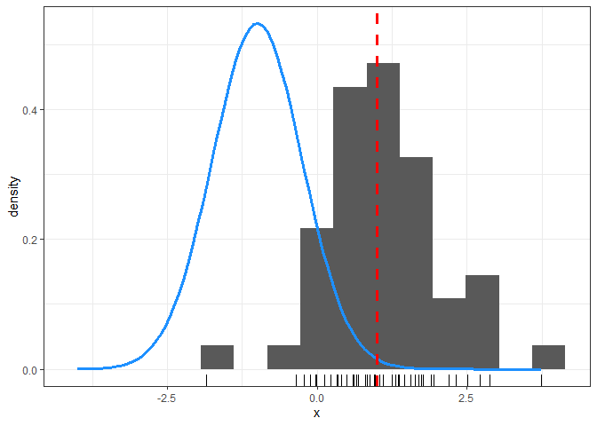<!-- -->

Another way to illustrate the same point, is to plot the observations in
a trace-like plot or run-chart. The x-axis is the counter or sample
index associated with each data point, and the y-axis is the observation
value. For reference, the prior mean,
, and
the prior  interval are denoted by solid and dashed
light blue horizontal lines, respectively. The *true* mean is denoted by
the dashed red horizontal line. As shown below, it is quite clear the
prior does not seem aligned with the “center” or “middle” of the
observations.

``` r
tibble::tibble(
  x = x
) %>% 
  tibble::rowid_to_column("obs_id") %>% 
  ggplot(mapping = aes(x = obs_id, y = x)) +
  geom_hline(yintercept = mu_true,
             color = "red", linetype = "dashed",
             size = 1.15) +
  geom_hline(yintercept = c(mu_0 - 2*tau_0, mu_0 + 2*tau_0),
             color = "dodgerblue",
             linetype = "dashed",
             size = 1.15) +
  geom_hline(yintercept = mu_0,
             color = "dodgerblue",
             size = 1.15) +
  geom_line(size = 1.15) +
  geom_point(size = 4) +
  labs(x = "sample index") +
  theme_bw()
```

<!-- -->

## Evaluate

In lecture, we discussed how to interpret the posterior distribution,
"), as a compromise between
the data and the prior. Although we did not step through the complete
derivation, we broke down the posterior into it’s key parts. We
discussed how the sample mean is the sufficient statistic, and that the
posterior mean is a precision weighted average of the prior mean and the
sample mean.

Rather than repeating those expressions here, we will instead visualize
the log-posterior as a function of
. We will
compare the log-likelihood with the log-prior to see how the two
influence the log-posterior, as we increase the number of observations.
Working with the log-posterior for this simple problem will serve as a
useful starting point for future problems where we do not have an
analytic expression for the posterior.

### log-posterior function

We will define a custom function which evaluates the log-posterior by
calculating the log-likelihood and the log-prior for a given value of
. The function
`ex_logpost()` is defined in the code chunk below.

``` r
ex_logpost <- function(mu, my_info)
{
  # log-likelihood -> sum up the independent
  # log-likelihoods 
  log_lik <- sum(dnorm(x = my_info$x,
                       mean = mu,
                       sd = my_info$sigma,
                       log = TRUE))
  
  # the log-prior
  log_prior <- dnorm(x = mu,
                     mean = my_info$mu_0,
                     sd = my_info$tau_0,
                     log = TRUE)
  
  # add the log-likelihood and log-prior
  log_lik + log_prior
}
```

`ex_logpost()` accepts two input arguments, `mu`, and `my_info`. The
argument `mu` is straightforward, it is just a value of
 we wish to
evaluate the log-posterior at. The argument `my_info` is a list which
stores the observations as the vector `x`, the assumed likelihood
standard deviation, `sigma`, and the prior hyperparameters, `mu_0` and
`tau_0`. Both the log-likelihood and log-prior are calculated by setting
the argument `log = TRUE` in the `dnorm()` function. As for why the
`dnorm()` function is used, remember that the likelihood and prior
consist of Gaussian distributions. `dnorm()` evaluates the normal
density function at a value defined by the `x` argument, given the
`mean` and standard deviation `sd`.

The log-likelihood value is stored is the variable `log_lik`. Please
note that the `sum()` function is wrapped around the `dnorm()` function
call. **Do you know why that is?**

The vector `my_info$x` is passed in as the first argument, while `mu`
and `my_info$sigma` are assigned to the `mean` and `sd` arguments,
respectively. Since `my_info$x` is a vector, `dnorm()` calculates a
normal density at each element in the vector. The `sum()` then sums up
those values producing the (complete) log-likelihood value. **Why is the
complete log-likelihood the sum of the individual observation
likelihoods?**

The log-prior is calculated much in the same way. The specified `mu`
value is passed in as the first argument and `my_info$mu_0` and
`my_info$tau_0` are assigned to the `mean` and `sd` arguments,
respectively. The log-prior is essentially calculating how “likely” the
specified value of `mu` is with respect to the prior.

#### for-loop

With the function defined, we can evaluate it as we would for any
function in `R`. Before calculating it however, we must define a list
which contains the required information. The code chunk below passes in
the first 3 data points as the observations `x`.

``` r
ex_info <- list(
  x = x[1:3],
  mu_0 = mu_0,
  tau_0 = tau_0,
  sigma_true = sigma_true
)
```

The `ex_logpost()` is intended to be evaluated at a single value of
`mu`, **not** at a vector of `mu`. The reason why will be made more
clear in future lectures. The code chunk below demonstrates evaluating
the `ex_logpost()` function at several different values for `mu`.

``` r
ex_logpost(0, ex_info)
```

    ## [1] -5.750332

``` r
ex_logpost(2, ex_info)
```

    ## [1] -15.06123

``` r
ex_logpost(-2, ex_info)
```

    ## [1] -15.55055

We will need to iteratively evaluate `ex_logpost()` in order to
calculate the log-posterior at many potential `mu` values. The most
basic way to do that is with a for-loop. We will first create a grid of
potential `mu` values we wish to evaluate the log-posterior at. We will
span $$6 prior standard deviations around the prior mean. Store that
grid in the vector `mu_grid`.

``` r
mu_grid <- seq(mu_0 - 6*tau_0, mu_0 + 6*tau_0, length.out = 501)
```

Next, initialize our response vector `ex_lp_result`.

``` r
ex_lp_result <- rep(as.numeric(NA), length(mu_grid))
```

And finally evaluate the log-posterior at each value of `mu` in the
`mu_grid` vector via a for-loop.

``` r
for(nn in seq_along(ex_lp_result))
{
  ex_lp_result[nn] <- ex_logpost(mu = mu_grid[nn], my_info = ex_info)
}
```

#### purrr

As straightforward as the for-loop is to create and execute, it is not
the most efficient way to accomplish this task. One of the downsides of
the for-loop is that we have to carefully manage the book keeping tasks
everytime we make a change or re-evaluate the functions of interest.

Rather than using for-loops directly, I prefer to use the `purrr`
package when I need to iterate or functionally program an operation.
`purrr` is the `tidyverse` version of the `R` suite of “apply”
functions. We will not cover `purrr` in great detail in this markdown,
but you can essentially think of using `purrr` functions to replace
for-loops. If you prefer to use a for-loop within this course, you are
welcome to do so. I will however use the `purrr` functions in lecture
and supplemental markdowns.

To demonstrate `purrr`, let’s re-evaluate the log-posterior over the
same set of values contained in `mu_grid`. Since the log-posterior
result is a `"numeric"` value, we will use the `purrr::map_dbl()`
function to perform the iteration. The basic syntax for `purrr::map*`
functions is:

`<map function>(<item to iterate over>, <function to apply> , <other
arguments to the function to apply>)`

Executing `ex_logpost()` over the vector `mu_grid` is accomplished in
the following code chunk.

``` r
ex_lp_purrr <- purrr::map_dbl(mu_grid,
                              ex_logpost,
                              my_info = ex_info)
```

Comparing the two results, `ex_lp_result` and `ex_lp_purrr` we see that
they are in fact identical.

``` r
all.equal(ex_lp_result, ex_lp_purrr)
```

    ## [1] TRUE

### Iterate over observations

The `ex_logpost()` function we created allows us to calculate the value
of the log-posterior for a given set of observations. If we would also
like to “loop over” the number of observations, we will need to place
additional “scaffolding” around our `ex_logpost()` function. We
essentially need an additional “wrapper” function which assembles the
correct dataset, based on the desired number of observations.

However, before creating the “wrapper” function, let’s modify our
log-posterior function. In it’s current state, `ex_logpost()` only
returns the log-posterior. We will change this so that the
log-likelihood and the log-prior are also returned. This will allow us
to compare all three quantities later on. The code chunk below defines a
new function, `my_logpost()` which returns each of the quantities within
a list.

``` r
my_logpost <- function(mu, my_info)
{
  # log-likelihood -> sum up the independent
  # log-likelihoods 
  log_lik <- sum(dnorm(x = my_info$x,
                       mean = mu,
                       sd = my_info$sigma,
                       log = TRUE))
  
  # add in the log-prior
  log_prior <- dnorm(x = mu,
                     mean = my_info$mu_0,
                     sd = my_info$tau_0,
                     log = TRUE)
  
  val <- log_lik + log_prior
  
  return(list(log_post = val,
              log_lik = log_lik,
              log_prior = log_prior))
}
```

The following chunk now wraps `my_logpost()` within the function
`eval_logpost()`. This “wrapper” manages the evaluation of the
log-posterior based on a desired number of observations. The first
argument, `Nuse`, specifies how many elements from the second argument,
`xobs`, to retain. The sliced vector is stored as the `x` element to the
third argument, `info`, which is a list containing the hyperparameter
information. `eval_logpost()` calculates the log-posterior over a grid
of possible 
values as defined in the fourth argument, `mu_grid`. As shown in the
code chunk below, the iteration, or looping, over `mu_grid` is
controlled by the `purrr::map_dfr()` function. `map_dfr()` stacks the
results into a `tibble` once the exection is completed. The last portion
of the function manages the book keeping by putting the results together
with the grid of  values.

``` r
eval_logpost <- function(Nuse, xobs, info, mu_grid)
{
  # package up the necessary information
  info$x <- xobs[1:Nuse]
  
  # caculate the log-posterior over the grid of
  # mu-values
  logpost_result <- purrr::map_dfr(mu_grid,
                                   my_logpost,
                                   my_info = info)
  
  # package together
  tibble::tibble(
    mu = mu_grid,
    log_post = logpost_result$log_post,
    log_lik = logpost_result$log_lik,
    log_prior = logpost_result$log_prior
  ) %>% 
    mutate(num_obs = Nuse)
}
```

The grid of possible  values is defined in the code chunk below. The vector `mu_grid`
consists of 501 points evenly spaced between $$6 prior standard
deviations, `tau_0`, around the prior mean, `mu_0`. We will use the same
grid of possible  values, that we used previously. Therefore, we are exploring
potential 
values from -5.5 up to 3.5.

Finally, let’s setup a list which stores the hyperparameter values
required to calculate the log-likelihood and the log-prior:

``` r
hyper_params <- list(
  mu_0 = mu_0,
  tau_0 = tau_0,
  sigma = sigma_true
)
```

With all of the pieces in place, we can now evaluate the log-posterior
as a function of , iterating over the number of observations. By looping over the
*number* of observations we will continuously increase how many
observations are used when evaluating the log-likelihood. When `Nuse
= 1` only the first element from the `xobs` is used, but when `Nuse = 3`
the first three elements are retained. In the code chunk below, the
iteration is conrolled by the `purrr::map_dfr()` function, which
compiles all of the results into a `tibble` and stores the result to the
`df_logpost`.

``` r
df_logpost <- purrr::map_dfr(seq_along(x),
                             eval_logpost,
                             xobs = x,
                             info = hyper_params,
                             mu_grid = mu_grid)
```

## Visualize results

#### 

We will start out visualizing the log-posterior with respect
 when just the
first observation is used. The following visualizations are similar to
those displayed in lecture, which compared the log-likelihood,
log-prior, and the log-posterior. The three curves are distinguished by
the curve color and linetype. **Question: Why are the curves parabolic
in shape?**

``` r
df_logpost %>% 
  tidyr::gather(key = "key", value = "value",
                -num_obs, -mu) %>% 
  filter(num_obs == 1) %>% 
  ggplot(mapping = aes(x = mu, y = value)) +
  geom_line(mapping = aes(group = interaction(num_obs,
                                              key),
                          color = key,
                          linetype = key),
            size = 1.2) +
  facet_grid(.~num_obs, labeller = label_bquote(cols = .(sprintf("N=%d", num_obs)))) +
  labs(x = expression(mu)) +
  ggthemes::scale_color_colorblind("") + scale_linetype_discrete("") +
  theme_bw() +
  theme(legend.position = "top")
```

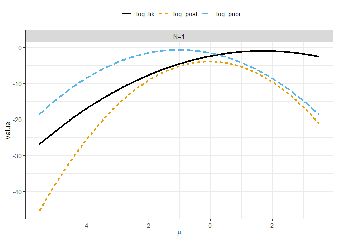<!-- -->

Let’s now walk through how to intepret the above figure. The
log-posterior is the sum of the log-likelihood and the log-prior. Thus,
if you add the solid black line (the log-likelihood) to the dashed light
blue line (the log-prior) you have the dashed orange line (the
log-posterior). That is why near 
where the log-prior is close to zero, the orange line is close to the
black line. similarly, when the log-likelihood is close to zero near
, the orange line is close to the light blue line.

Next, consider where the maximum values for each curve are located at.
The peak log-prior value occurs at 
because we specified the hyperparameter . Why does the log-likelihood peak near  1.7? With a single observation the sample average,
, is equal to the observation value. The first element
in our random observation vector `x` is approximately equal to 1.7. The
log-likelihood is reaching is maximum near 1.7 because the sample
average, which corresponds to the Maximum Likelihood Estimate (MLE), is
close to 1.7.

What about the log-posterior? Why does it peak near ? As we discussed in lecture, the posterior is a
balance or compromise betwween the prior and the data. The posterior
mean, , is a *precision* weighted average between the prior mean,
, and the sample average,
. The previous figure shows that when one of the
components is near zero, the log-posterior is close to the other
component. The result is that when the log-likelihood is close to zero
around the MLE, the log-prior “pulls” or “shrinks” the log-posterior
away from the MLE. We can equivalently say that the log-likelihood is
“pulling” or “adjusting” the log-posterior away from the prior mean.
The result is a compromise between the two.

We will now calculate summary statistics using the expressions described
in lecture. The code chunk below calculates the sample average, the
posterior mean, and other quantities based on the number of
observations.

``` r
post_summary <- tibble::tibble(
  xobs = x
) %>% 
  tibble::rowid_to_column("N") %>% 
  mutate(sample_avg = cummean(xobs)) %>% 
  mutate(data_precision = N / sigma_true^2,
         post_prec = 1/tau_0^2 + data_precision,
         post_mu = ((1/tau_0^2) * mu_0 + data_precision * sample_avg)/post_prec,
         post_sd = sqrt(1 / post_prec))
```

Let’s now make use of those summary statistics. Include the prior mean,
sample average, and posterior mean after  in the
plot of the log-posterior with respect to
 as vertical
lines. These vertical lines correspond to the peak values of their
respective curves. **Question: why is the peak or mode equal to the mean
for each of these curves?**

``` r
df_logpost %>% 
  tidyr::gather(key = "key", value = "value",
                -num_obs, -mu) %>% 
  filter(num_obs == 1) %>% 
  ggplot(mapping = aes(x = mu, y = value)) +
  geom_line(mapping = aes(group = interaction(num_obs,
                                              key),
                          color = key,
                          linetype = key),
            size = 1.2) +
  geom_vline(data = post_summary %>% 
               mutate(prior_mu = mu_0) %>% 
               filter(N == 1) %>% 
               select(num_obs = N, sample_avg, prior_mu, post_mu) %>% 
               tidyr::gather(key = "stat_name", value = "value",
                             -num_obs) %>% 
               mutate(key = ifelse(stat_name == "sample_avg",
                                   "log_lik",
                                   ifelse(stat_name == "prior_mu",
                                          "log_prior",
                                          "log_post"))),
             mapping = aes(xintercept = value,
                           color = key,
                           linetype = key),
             size = 1.25,
             show.legend = FALSE) +
  facet_grid(.~num_obs, labeller = label_bquote(cols = .(sprintf("N=%d", num_obs)))) +
  labs(x = expression(mu)) +
  ggthemes::scale_color_colorblind("") + scale_linetype_discrete("") +
  theme_bw() +
  theme(legend.position = "top")
```

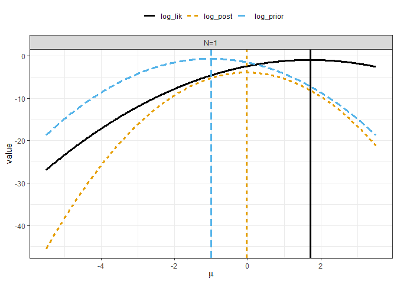<!-- -->

As shown in the above figure, the posterior mean (the vertical dashed
orange line) is located in between the prior mean and the sample
average. However,
 is **not** exactly in the middle of those two quantites. It
appears to be slightly closer to the prior mean,
. **Why is that?** Let’s return to the math to see why. As
mentioned several times, the posterior mean is a precision weighted
average between the prior mean and the data. With , the
equation from lecture for the posterior precision simplifies to:

  
  

We had specified our prior to have  0.75 and we assumed that the known likelihood standard
deviation was  1.
Thus, the prior is *more precise* than the single observation.

Now consider the expression on the posterior mean with :

  
  

Substitute in the prior standard deviation and assumed likelihood noise:

  
  

Simplify the expression:

  
  

Which reduces to:

  
  

Thus, the weight applied to the prior mean is greater than the weight
applied to the sample average after one observation, in this
example\!

#### 

We will now repeat the previous figure, but include the results based on
retaining two and three observations. The number of observations,
, associated with each
figure is displayed in the strip title at the top of each facet. The
color scheme is the same as the previous figure, and the vertical lines
denote the 
value corresponding to the max log-density for each curve. The log-prior
is the same across facets. The log-likelihood and log-posterior however
change as the number of observations increase left to right.

``` r
df_logpost %>% 
  tidyr::gather(key = "key", value = "value",
                -num_obs, -mu) %>% 
  filter(num_obs %in% 1:3) %>% 
  ggplot(mapping = aes(x = mu, y = value)) +
  geom_line(mapping = aes(group = interaction(num_obs,
                                              key),
                          color = key,
                          linetype = key),
            size = 1.2) +
  geom_vline(data = post_summary %>% 
               mutate(prior_mu = mu_0) %>% 
               filter(N %in% 1:3) %>% 
               select(num_obs = N, sample_avg, prior_mu, post_mu) %>% 
               tidyr::gather(key = "stat_name", value = "value",
                             -num_obs) %>% 
               mutate(key = ifelse(stat_name == "sample_avg",
                                   "log_lik",
                                   ifelse(stat_name == "prior_mu",
                                          "log_prior",
                                          "log_post"))),
             mapping = aes(xintercept = value,
                           color = key,
                           linetype = key),
             size = 1.25,
             show.legend = FALSE) +
  facet_grid(.~num_obs, labeller = label_bquote(cols = .(sprintf("N=%d", num_obs)))) +
  labs(x = expression(mu)) +
  ggthemes::scale_color_colorblind("") + scale_linetype_discrete("") +
  theme_bw() +
  theme(legend.position = "top")
```

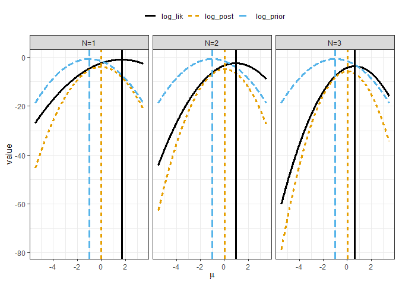<!-- -->

One of the key takeaways from the figure above is, that the the
log-likelihood becomes less “shallow” as
 increases. Another key
point is that the log-posterior (the orange curve) appears to follow the
log-likelihood for more of the plotting interval as
 increases. Lastly, the
posterior mean appears to be closer to the sample average than the prior
mean in the  facet.

Let’s check the posterior precision and mean expressions to understand
why this is the case. For , the
posterior precision can be written as:

  
  

Substituting the values for
 and
 into
the posterior mean expression gives:

  
  

Which can be simplified to:

  
  

The weight applied to the sample average is now greater than the weight
applied to the prior mean\! The posterior mean will therefore continue
to become closer and closer to the sample average as
 increases. The code
chunk below generates a figure showing the results up to the including
the first 
observations.

``` r
df_logpost %>% 
  tidyr::gather(key = "key", value = "value",
                -num_obs, -mu) %>% 
  filter(num_obs %in% 1:6) %>% 
  ggplot(mapping = aes(x = mu, y = value)) +
  geom_line(mapping = aes(group = interaction(num_obs,
                                              key),
                          color = key,
                          linetype = key),
            size = 1.2) +
  geom_vline(data = post_summary %>% 
               mutate(prior_mu = mu_0) %>% 
               filter(N %in% 1:6) %>% 
               select(num_obs = N, sample_avg, prior_mu, post_mu) %>% 
               tidyr::gather(key = "stat_name", value = "value",
                             -num_obs) %>% 
               mutate(key = ifelse(stat_name == "sample_avg",
                                   "log_lik",
                                   ifelse(stat_name == "prior_mu",
                                          "log_prior",
                                          "log_post"))),
             mapping = aes(xintercept = value,
                           color = key,
                           linetype = key),
             size = 1.25,
             show.legend = FALSE) +
  facet_grid(.~num_obs, labeller = label_bquote(cols = .(sprintf("N=%d", num_obs)))) +
  labs(x = expression(mu)) +
  ggthemes::scale_color_colorblind("") + scale_linetype_discrete("") +
  theme_bw() +
  theme(legend.position = "top")
```

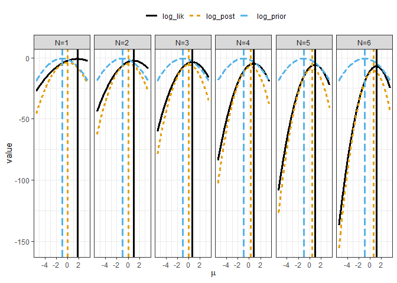<!-- -->

Zoom in on the y-axis to help make it easier to see. As shown below, by
 the posterior
mean (the vertical dashed orange line) is very close to the sample
average (the vertical solid black line).

``` r
df_logpost %>% 
  tidyr::gather(key = "key", value = "value",
                -num_obs, -mu) %>% 
  filter(num_obs %in% 1:6) %>% 
  ggplot(mapping = aes(x = mu, y = value)) +
  geom_line(mapping = aes(group = interaction(num_obs,
                                              key),
                          color = key,
                          linetype = key),
            size = 1.2) +
  geom_vline(data = post_summary %>% 
               mutate(prior_mu = mu_0) %>% 
               filter(N %in% 1:6) %>% 
               select(num_obs = N, sample_avg, prior_mu, post_mu) %>% 
               tidyr::gather(key = "stat_name", value = "value",
                             -num_obs) %>% 
               mutate(key = ifelse(stat_name == "sample_avg",
                                   "log_lik",
                                   ifelse(stat_name == "prior_mu",
                                          "log_prior",
                                          "log_post"))),
             mapping = aes(xintercept = value,
                           color = key,
                           linetype = key),
             size = 1.25,
             show.legend = FALSE) +
  coord_cartesian(ylim = c(-50, 5)) +
  facet_grid(.~num_obs, labeller = label_bquote(cols = .(sprintf("N=%d", num_obs)))) +
  labs(x = expression(mu)) +
  ggthemes::scale_color_colorblind("") + scale_linetype_discrete("") +
  theme_bw() +
  theme(legend.position = "top")
```

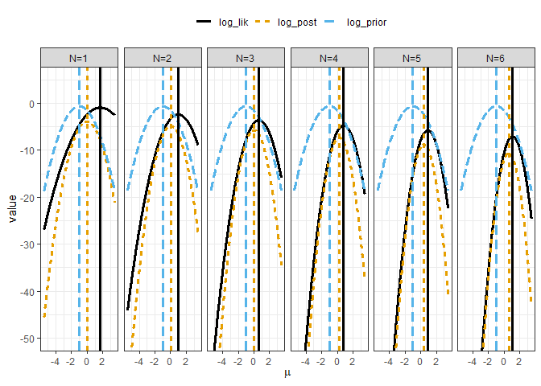<!-- -->

Pushing the sample size up to
, we see that
the log-posterior appears indistinguishable from the log-likelihood. The
figure below may seem a little confusing at first. After all, the
log-prior is the same in every figure we have plotted. So why does it
appear to be so different now? The key to that question, lies in the
scale of the y-axis. With
, the
 values far
from the sample average are ruled to be highly improbable. Remember that
we are plotting the log-posterior. The posterior density is
 to the value shown on
the y-axis. Thus, many of the
 values have
density values of essentially 0 by
.

``` r
df_logpost %>% 
  tidyr::gather(key = "key", value = "value",
                -num_obs, -mu) %>% 
  filter(num_obs %in% 50) %>% 
  ggplot(mapping = aes(x = mu, y = value)) +
  geom_line(mapping = aes(group = interaction(num_obs,
                                              key),
                          color = key,
                          linetype = key),
            size = 1.2) +
  geom_vline(data = post_summary %>% 
               mutate(prior_mu = mu_0) %>% 
               filter(N %in% 50) %>% 
               select(num_obs = N, sample_avg, prior_mu, post_mu) %>% 
               tidyr::gather(key = "stat_name", value = "value",
                             -num_obs) %>% 
               mutate(key = ifelse(stat_name == "sample_avg",
                                   "log_lik",
                                   ifelse(stat_name == "prior_mu",
                                          "log_prior",
                                          "log_post"))),
             mapping = aes(xintercept = value,
                           color = key,
                           linetype = key),
             size = 1.25,
             show.legend = FALSE) +
  facet_grid(.~num_obs, labeller = label_bquote(cols = .(sprintf("N=%d", num_obs)))) +
  labs(x = expression(mu)) +
  ggthemes::scale_color_colorblind("") + scale_linetype_discrete("") +
  theme_bw() +
  theme(legend.position = "top")
```

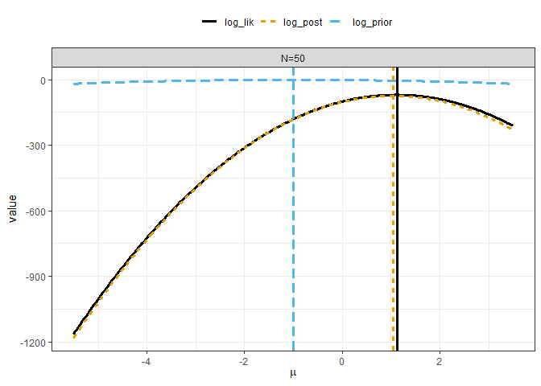<!-- -->

To help visualize the reduction in the posterior uncertainty, the code
chunk below creates a trace-style plot showing the posterior mean and
posterior 90% uncertainty interval with respect to the number of
observations, . The
posterior 90% uncertainty interval is represented by the transparent
orange ribbon, while the posterior mean is given by the dashed orange
line. The sample average with respect to the sample size,
, is shown by the solid
black line. Lastly, the true mean which was used to generate the random
observations is given by the thin red horizontal line.

``` r
post_summary %>% 
  ggplot(mapping = aes(x = N)) +
  geom_hline(yintercept = mu_true, color = "red") +
  geom_ribbon(mapping = aes(ymin = post_mu - 2*post_sd,
                            ymax = post_mu + 2*post_sd),
              fill = "darkorange", alpha = 0.25) +
  geom_line(mapping = aes(y = post_mu,
                          color = "posterior mean",
                          linetype = "posterior mean"),
            size = 1.2) +
  geom_line(mapping = aes(y = sample_avg,
                          color = "sample average",
                          linetype = "sample average"),
            size = 1.2) +
  scale_color_manual("",
                     values = c("posterior mean" = "darkorange",
                                "sample average" = "black")) +
  scale_linetype_manual("",
                     values = c("posterior mean" = "dashed",
                                "sample average" = "solid")) +
  labs(y = expression(mu)) +
  theme_bw() +
  theme(legend.position = "top")
```

<!-- -->

## Diffuse prior

In lecture, we also discussed what happens if we use a **diffuse** or
**ignorant** prior compared to an **informative** one. We stepped
through how the posterior distribution on
 converges in
the limit of  to:

  
 \\approx \\mathrm{normal}\\left( \\mu \\mid \\overline{x}, \\frac{\\sigma}{\\sqrt{N}} \\right)
")  

We will now define a diffuse prior for our example. Instead of using
, let’s instead use  or 10 times the known likelihood standard deviation\!
In the code chunk below, the new diffuse prior standard deviation is
defined as `tau_0_diffuse` and the two priors are compared relative to
the 50 observations. As shown below, the diffuse prior is nearly uniform
over the plotting interval.

``` r
tau_0_diffuse <- 10

### compare the informative vs diffuse priors
tibble::tibble(
  x = x
) %>% 
  ggplot(mapping = aes(x = x)) +
  geom_histogram(bins = 15,
                 mapping = aes(y = stat(density))) +
  geom_rug() +
  stat_function(data = data.frame(x = mu_0 + c(-4*tau_0, 4*tau_0)),
                mapping = aes(color = "informative prior"),
                fun = dnorm, 
                args = list(mean = mu_0, sd = tau_0),
                size = 1.15) +
  stat_function(data = data.frame(x = mu_0 + c(-4*tau_0, 4*tau_0)),
                mapping = aes(color = "diffuse prior"),
                fun = dnorm, 
                args = list(mean = mu_0, sd = tau_0_diffuse),
                size = 1.15) +
  scale_color_manual("", 
                     values = c("informative prior" = "dodgerblue",
                                "diffuse prior" = "purple")) +
  theme_bw() +
  theme(legend.position = "top")
```

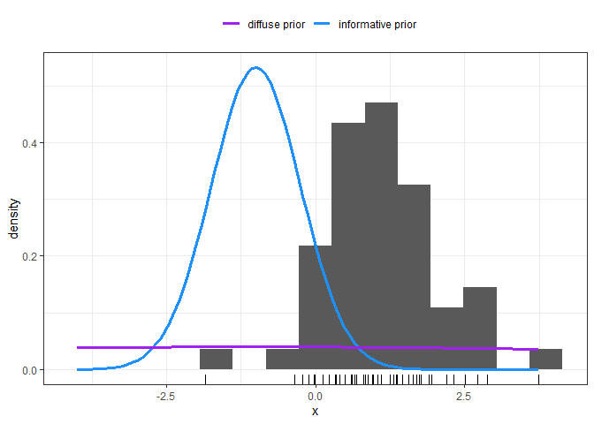<!-- -->

Because we defined our analysis within functions, we can repeat our
previous analysis with just a few lines of code. We need to define a new
list of hyperparameter values, and then pass that new list into the
`eval_logpost()` through a `purrr::map_dfr()` to loop over the number of
observations. The code chunk below performs all of the necessary actions
to repeat the analysis with the diffuse prior.

``` r
### package up the hyperparameters with the diffuse prior
hyper_params_diffuse <- list(
  mu_0 = mu_0,
  tau_0 = tau_0_diffuse,
  sigma = sigma_true
)

### calculate the logposterior over the grid of mu values
### based on sequentially adding each observations
df_logpost_diffuse <- purrr::map_dfr(seq_along(x),
                                     eval_logpost,
                                     xobs = x,
                                     info = hyper_params_diffuse,
                                     mu_grid = mu_grid)
```

#### 

As we did with the informative prior results, let’s start analyzing the
diffuse prior results for the case with a single observation,
. The
log-posterior, log-likelihood, and log-prior based on the diffuse prior
are plotted with respect to
 in the figure
below. The log-likelihood is the same as the log-likelihood from the
informative prior case. **Why is that?** The log-prior however, is
clearly different from what we saw before. It is essentially constant
over the plotting interval. This causes the log-posterior to be parallel
to the log-likelihood. The dashed orange line, in the figure below, is
essentially shifted down from the solid black curve. There no longer
seems to be balancing act or “pulling” between the prior and likelihood.

``` r
df_logpost_diffuse %>% 
  tidyr::gather(key = "key", value = "value",
                -num_obs, -mu) %>% 
  filter(num_obs == 1) %>% 
  ggplot(mapping = aes(x = mu, y = value)) +
  geom_line(mapping = aes(group = interaction(num_obs,
                                              key),
                          color = key,
                          linetype = key),
            size = 1.2) +
  facet_grid(.~num_obs, labeller = label_bquote(cols = .(sprintf("N=%d", num_obs)))) +
  labs(x = expression(mu)) +
  ggthemes::scale_color_colorblind("") + scale_linetype_discrete("") +
  theme_bw() +
  theme(legend.position = "top")
```

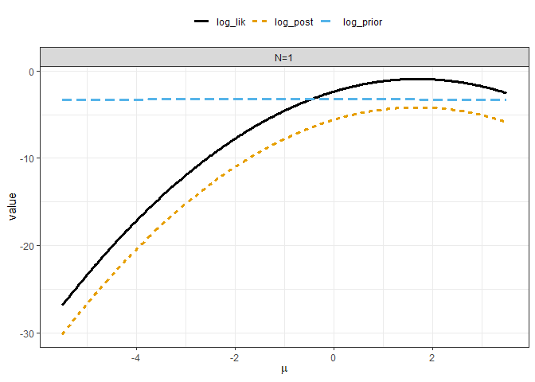<!-- -->

As we did before, let’s include the posterior mean, prior mean, and
sample average as vertical lines along with the log-densities. The
posterior summary statistics are recalculated in the code chunk below.

``` r
post_summary_diffuse <- tibble::tibble(
  xobs = x
) %>% 
  tibble::rowid_to_column("N") %>% 
  mutate(sample_avg = cummean(xobs)) %>% 
  mutate(data_precision = N / sigma_true^2,
         post_prec = 1/tau_0_diffuse^2 + data_precision,
         post_mu = ((1/tau_0_diffuse^2) * mu_0 + data_precision * sample_avg)/post_prec,
         post_sd = sqrt(1 / post_prec))
```

The means are included as vertical lines in the figure below. Since the
log-posterior is essentially just shifted down from the log-likelihood
the posterior mean is nearly identical to the sample average. The
log-prior has no impact at all\!

``` r
df_logpost_diffuse %>% 
  tidyr::gather(key = "key", value = "value",
                -num_obs, -mu) %>% 
  filter(num_obs %in% 1) %>% 
  ggplot(mapping = aes(x = mu, y = value)) +
  geom_line(mapping = aes(group = interaction(num_obs,
                                              key),
                          color = key,
                          linetype = key),
            size = 1.2) +
  geom_vline(data = post_summary_diffuse %>% 
               mutate(prior_mu = mu_0) %>% 
               filter(N %in% 1) %>% 
               select(num_obs = N, sample_avg, prior_mu, post_mu) %>% 
               tidyr::gather(key = "stat_name", value = "value",
                             -num_obs) %>% 
               mutate(key = ifelse(stat_name == "sample_avg",
                                   "log_lik",
                                   ifelse(stat_name == "prior_mu",
                                          "log_prior",
                                          "log_post"))),
             mapping = aes(xintercept = value,
                           color = key,
                           linetype = key),
             size = 1.25,
             show.legend = FALSE) +
  facet_grid(.~num_obs, labeller = label_bquote(cols = .(sprintf("N=%d", num_obs)))) +
  labs(x = expression(mu)) +
  ggthemes::scale_color_colorblind("") + scale_linetype_discrete("") +
  theme_bw() +
  theme(legend.position = "top")
```

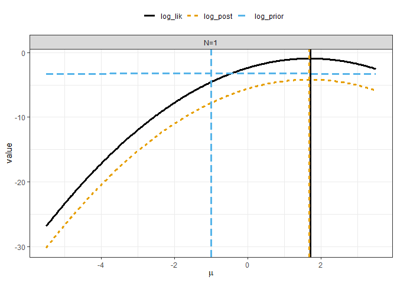<!-- -->

To see why this is the case mathematically, let’s look at the posterior
precision after a single observation. To make it clear we are working
from the diffuse prior, denote the prior standard deviation as
.

  
  
Substituting in the values gives the posterior precision at
 to be:

  
  

The posterior precision is approximately equal to 1. Thus, the posterior
precision after 1 observation is already essentially equal to the data
precision\! We can therefore anticipate that the weights in the
posterior mean expression will be dominated by the sample mean term. To
confirm that is indeed true, substitute in the values into the posterior
mean expression for :

  
  

Which can be simplified to yield:

  
  

If the prior mean and the sample average are of similar orders of
magnitude, the weight from the prior precision is so low that the
posterior mean will be approximately equal to the sample average. This
is indeed true, as seen by printing the observed value and the posterior
mean to the screen (remember the prior mean is -1):

``` r
post_summary_diffuse %>% 
  filter(N == 1) %>% 
  select(N, sample_avg, post_mu)
```

    ## # A tibble: 1 x 3
    ##       N sample_avg post_mu
    ##   <int>      <dbl>   <dbl>
    ## 1     1       1.70    1.68

Let’s now visually compare the diffuse prior and informative prior based
results side by side.

``` r
df_logpost %>% 
  mutate(type = "informative prior") %>% 
  bind_rows(df_logpost_diffuse %>% 
              mutate(type = "diffuse prior")) %>% 
  tidyr::gather(key = "key", value = "value",
                -num_obs, -mu, -type) %>% 
  filter(num_obs == 1) %>% 
  ggplot(mapping = aes(x = mu, y = value)) +
  geom_line(mapping = aes(group = interaction(num_obs,
                                              key),
                          color = key,
                          linetype = key),
            size = 1.2) +
  facet_grid(num_obs ~ type, labeller = label_bquote(rows = .(sprintf("N=%d", num_obs)),
                                                     cols = .(type))) +
  labs(x = expression(mu)) +
  ggthemes::scale_color_colorblind("") + scale_linetype_discrete("") +
  theme_bw() +
  theme(legend.position = "top")
```

<!-- -->

In the figure above, adding the informative log-prior to the
log-likelihood produces a log-posterior with a curvature (shape)
different from that of the log-likelihood. Equivalently, we could say
the log-likelihood “alters” the shape of the log-prior to generate the
log-posterior. Either way, the log-posterior truly is a compromise
between the two. However, with the diffuse prior the log-prior has
minimal influence on the log-likelihood’s curvature. Essentially the
only impact of the log-prior is to vertically shift the
log-likelihood.

#### 

We saw previously that as we increase the sample size, the log-posterior
gets closer and closer to the log-likelihood. As we just saw in the case
with the diffuse prior, we start out similar to the log-likelihood at
. Thus
increasing the sample size simply makes the log-posterior even closer to
the log-likelihood.

Let’s continue to compare the diffuse and informative prior results as
we increase the sample size. The code chunk below wraps the `ggplot2`
figure within a function which allows us to easily loop over the sample
size. Notice that for a `ggplot2` figure, we explictly stated we wish to
`print()` the figure. That’s because `ggplot2` figures will not
automatically render when they are called within a loop or iteration
scheme.

``` r
compare_post_result_fig <- function(Nuse)
{
  gg <- df_logpost %>% 
  mutate(type = "informative prior") %>% 
  bind_rows(df_logpost_diffuse %>% 
              mutate(type = "diffuse prior")) %>% 
  tidyr::gather(key = "key", value = "value",
                -num_obs, -mu, -type) %>% 
  filter(num_obs %in% Nuse) %>% 
  ggplot(mapping = aes(x = mu, y = value)) +
  geom_line(mapping = aes(group = interaction(num_obs,
                                              key),
                          color = key,
                          linetype = key),
            size = 1.2) +
  facet_grid(num_obs ~ type, labeller = label_bquote(rows = .(sprintf("N=%d", num_obs)),
                                                     cols = .(type))) +
  labs(x = expression(mu)) +
  ggthemes::scale_color_colorblind("") + scale_linetype_discrete("") +
  theme_bw() +
  theme(legend.position = "top")
  
  print(gg)
}
```

Display the comparison figure for the
 and 
observation cases. Since we are not storing results to an object, we
iterate using the `purrr::walk()` function. **Question:** What can you
say is similar between the diffuse and informative prior results when
 observations
are used?

``` r
purrr::walk(c(3, 5, 10, 25),
            compare_post_result_fig)
```

<!-- --><!-- -->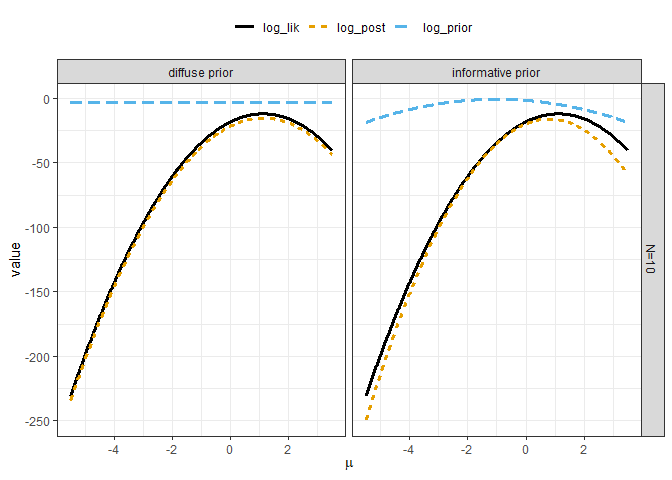<!-- -->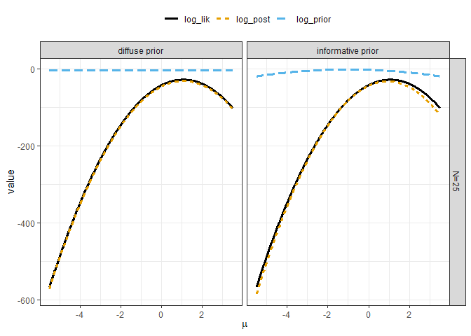<!-- -->

Lastly, compare the posterior summary statistics on
 between the
diffuse and informative prior cases in the run-style chart. As shown in
the figure below, the posterior mean based on the diffuse prior is
essentially inline with the sample average.

``` r
post_summary %>% 
  mutate(prior_type = "informative prior") %>% 
  bind_rows(post_summary_diffuse %>% 
              mutate(prior_type = "diffuse prior")) %>% 
  ggplot(mapping = aes(x = N)) +
  geom_hline(yintercept = mu_true, 
             color = "red") +
  geom_ribbon(mapping = aes(ymin = post_mu -2*post_sd,
                            ymax = post_mu +2*post_sd,
                            group = prior_type),
              fill = "darkorange", alpha = 0.25) +
  geom_line(mapping = aes(y = sample_avg,
                          group = prior_type,
                          color = "sample average",
                          linetype = "sample average"),
            size = 1.15) +
  geom_line(mapping = aes(y = post_mu,
                          group = prior_type,
                          color = "posterior mean",
                          linetype = "posterior mean"),
            size = 1.15) +
  facet_grid(. ~ prior_type) +
  scale_color_manual("",
                     values = c("posterior mean" = "darkorange",
                                "sample average" = "black")) +
  scale_linetype_manual("",
                        values = c("posterior mean" = "dashed",
                                   "sample average" = "solid")) +
  labs(y = expression(mu)) +
  theme_bw() +
  theme(legend.position = "top")
```

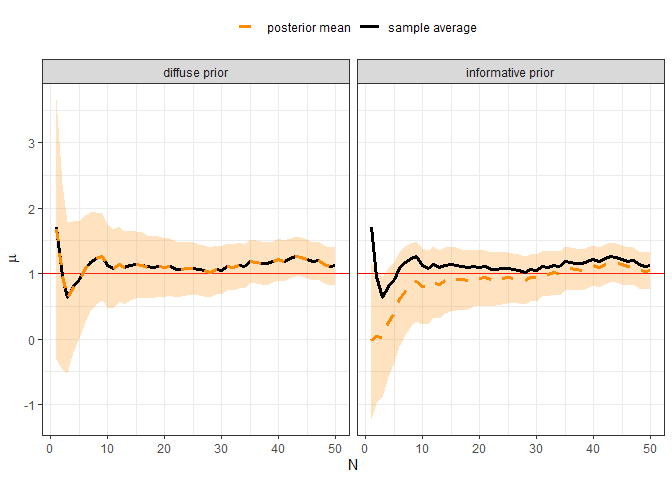<!-- -->

## Why use a prior?

At this point, you might be asking yourself, “What’s the point with this
prior business?”. We have seen how as we collect more data our prior
beliefs can start to vanish. We have also seen how if we start out with
a very uncertain prior, we “track” or “follow” the sample average after
just one observation. So why would we want to bias away from the sample
average?

We could answer this by saying this is a contrived “toy” demonstration
problem. Although true, that answer is not very satisfactory or
comforting. Instead let’s focus on the fact that we have up to this
point assumed the *data generating process* was relatively *precise*
with . What if instead, we had a situation
where the *true* standard deviation of the process was ? How would this impact our results?

### Sample size

Let’s first consider this from the perspective of the sample size. In
the limit of a completely diffuse prior, , the standard deviation on the
posterior mean is:

  
  

With , the approximate posterior standard deviation after  is
therefore:

  
  

**If the *true* standard deviation was instead , how many samples would be required to match the above
value in the limit of ?**

We will denote this new “noisy” process as
 and the required sample size as
. First, set the expressions equal to each other.

  
  

Square both sides:

  
  

Solve for
:

  
  

Substitute in the values and solve for the required sample size:

  
^2 \\cdot 50 = 100 \\cdot 50 = 5000
")  

We would therefore need **5000** observations to achieve the same
posterior precision as we had with the more precise process\!

### Simulation study

Let’s repeat our synthetic data example, but now with the less precise
*data generating process*. The code chunk below defines the noisy
standard deviation as `sigma_noisy` and then generates 5000 random
observations, using the same *true* mean value as before. The new
“noisy” observations are stored in the vector `x_noisy`.

``` r
sigma_noisy <- 10

set.seed(2002)
x_noisy <- rnorm(n = 5000, mean = mu_true, sd = sigma_noisy)
```

The distribution of the noisy observations is visualized below with a
histogram. Note that now, the most extreme observations lie less than
-25 and greater than +25.

``` r
tibble::tibble(
  x = x_noisy
) %>% 
  ggplot(mapping = aes(x = x)) +
  geom_histogram(bins = 55,
                 mapping = aes(y = stat(density))) +
  geom_rug() +
  theme_bw()
```

<!-- -->

These extreme values are clearly not representative of the true mean
value of 1. But, just how rare are they? The probability of finding a
value greater than 25 can be calculated using the `pnorm()` function, as
shown in the code chunk below:

``` r
100*(1 - pnorm(25, mean = mu_true, sd = sigma_noisy))
```

    ## [1] 0.8197536

Thus, there is less than a 1% chance of finding an extreme value of
greater than 25. However, what about a value greater than 10? Or greater
than 5? Let’s calculate the 25th and 75th quantiles for our noisy *data
generating process*:

``` r
qnorm(p = 0.75, mean = mu_true, sd = sigma_noisy)
```

    ## [1] 7.744898

``` r
qnorm(p = 0.25, mean = mu_true, sd = sigma_noisy)
```

    ## [1] -5.744898

We therefore have a 50% chance to find values between -5.74 and 7.74. To
visualize the impact of this noisier process, let’s overlay the two
priors we used previously on top of the histogram of the noisy
observations. As shown in the figure below, the diffuse prior from
before approximates the distribution of the observations\! If all values
over the complete range of the observations are allowed, we could be
susceptable at being unrepresentative of the true mean at low sample
sizes. The informative prior is concentrated within a narrow interval
around -1. Visualized in this way, the informative prior is essentially
throwing away the extreme values from being considered within the
estimation of the mean. To help see just why that is in fact true, we
will repeat our log-posterior calculations from before.

``` r
tibble::tibble(
  x = x_noisy
) %>% 
  ggplot(mapping = aes(x = x)) +
  geom_histogram(bins = 55,
                 mapping = aes(y = stat(density))) +
  geom_rug() +
  stat_function(data = data.frame(x = range(x_noisy)),
                mapping = aes(color = "informative prior"),
                fun = dnorm, 
                args = list(mean = mu_0, sd = tau_0),
                size = 1.15) +
  stat_function(data = data.frame(x = range(x_noisy)),
                mapping = aes(color = "diffuse prior"),
                fun = dnorm, 
                args = list(mean = mu_0, sd = tau_0_diffuse),
                size = 1.15) +
  scale_color_manual("", 
                     values = c("informative prior" = "dodgerblue",
                                "diffuse prior" = "purple")) +
  theme_bw() +
  theme(legend.position = "top")
```

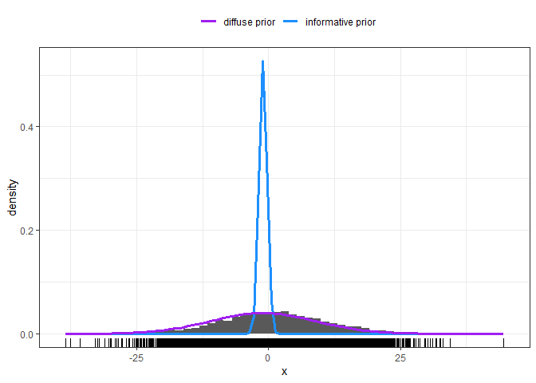<!-- -->

### Informative prior

We will now repeat the log-posterior evaluation. The code chunk below
defines a new hyperparameter list, using the **informative** prior
standard deviation and the **noisy** likelihood standard deviation. A
new set of grid points are also created spanning a wider range from
before. Rather than looping over all 5000 observations, we will just
performing the evaluation over the first 200 observations.

``` r
### package up the hyperparameters with the noisy setting
hyper_params_noisy <- list(
  mu_0 = mu_0,
  tau_0 = tau_0,
  sigma = sigma_noisy
)

### create a new set of grid points
mu_grid_new <- seq(-10, 10, length.out = 1001)

### calculate the logposterior over the grid of mu values
### based on sequentially adding each observations
df_logpost_noisy <- purrr::map_dfr(1:200,
                                   eval_logpost,
                                   xobs = x,
                                   info = hyper_params_noisy,
                                   mu_grid = mu_grid_new)
```

#### Visualize results

The log-densities based on the first observation are visualized in the
figure below with respect to
. As shown
below, we have the opposite situation from before\! The log-likelihood
is now effectively constant over the plotting interval. The
log-posterior is parallel to the prior, and thus the posterior shape is
the same as the prior shape.

``` r
df_logpost_noisy %>% 
  tidyr::gather(key = "key", value = "value",
                -num_obs, -mu) %>% 
  filter(num_obs == 1) %>% 
  ggplot(mapping = aes(x = mu, y = value)) +
  geom_line(mapping = aes(group = interaction(num_obs,
                                              key),
                          color = key,
                          linetype = key),
            size = 1.2) +
  facet_grid(.~num_obs, labeller = label_bquote(cols = .(sprintf("N=%d", num_obs)))) +
  labs(x = expression(mu)) +
  ggthemes::scale_color_colorblind("") + scale_linetype_discrete("") +
  theme_bw() +
  theme(legend.position = "top")
```

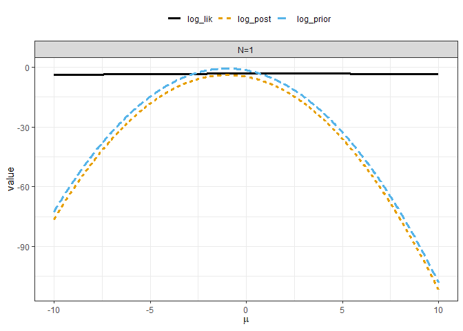<!-- -->

Even after including 12 observations, we stil do not see a major
influence from the likelihood.

``` r
df_logpost_noisy %>% 
  tidyr::gather(key = "key", value = "value",
                -num_obs, -mu) %>% 
  filter(num_obs %in% 1:12) %>% 
  ggplot(mapping = aes(x = mu, y = value)) +
  geom_line(mapping = aes(group = interaction(num_obs,
                                              key),
                          color = key,
                          linetype = key),
            size = 1.2) +
  facet_wrap(~num_obs, labeller = label_bquote(.(sprintf("N=%d", num_obs)))) +
  labs(x = expression(mu)) +
  ggthemes::scale_color_colorblind("") + scale_linetype_discrete("") +
  theme_bw() +
  theme(legend.position = "top")
```

<!-- -->

Rather than continuing to plot the log-densities as we increase the
sample size further, let’s use the posterior summary statistics to see
what happens as  gets
into the several hundreds. The code chunk below calculates the posterior
summaries using the noisy likelihood standard deviation and the
informative prior.

``` r
post_summary_noisy <- tibble::tibble(
  xobs = x_noisy
) %>% 
  tibble::rowid_to_column("N") %>% 
  mutate(sample_avg = cummean(xobs)) %>% 
  mutate(data_precision = N / sigma_noisy^2,
         post_prec = 1/tau_0^2 + data_precision,
         post_mu = ((1/tau_0^2) * mu_0 + data_precision * sample_avg)/post_prec,
         post_sd = sqrt(1 / post_prec))
```

The code chunk below plots the posterior summary on
 with respsect
to the sample size. The sample average is also included along with the
true mean value as reference.

``` r
post_summary_noisy %>% 
  ggplot(mapping = aes(x = N)) +
  geom_hline(yintercept = mu_true, color = "red") +
  geom_ribbon(mapping = aes(ymin = post_mu - 2*post_sd,
                            ymax = post_mu + 2*post_sd),
              fill = "darkorange", alpha = 0.25) +
  geom_line(mapping = aes(y = post_mu,
                          color = "posterior mean",
                          linetype = "posterior mean"),
            size = 1.2) +
  geom_line(mapping = aes(y = sample_avg,
                          color = "sample average",
                          linetype = "sample average"),
            size = 1.2) +
  scale_color_manual("",
                     values = c("posterior mean" = "darkorange",
                                "sample average" = "black")) +
  scale_linetype_manual("",
                     values = c("posterior mean" = "dashed",
                                "sample average" = "solid")) +
  labs(y = expression(mu)) +
  theme_bw() +
  theme(legend.position = "top")
```

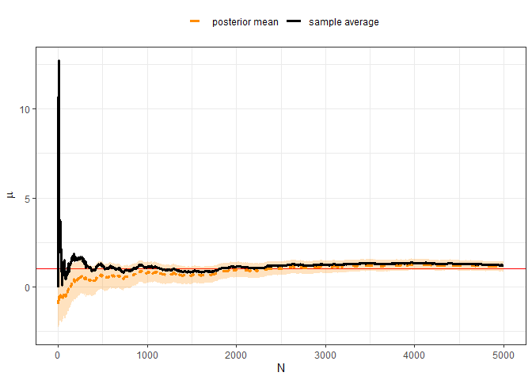<!-- -->

Zoom in to focus on the first 50 observations in the run style chart. As
shown below, even though the posterior 90% uncertainty interval misses
the true mean over the first 50 observations, the posterior is **not**
impacted by small sample sizes to the same effect as the sample average.
After 5 observations, the sample average is reporting an estimate of
about 13, compared with the posterior mean of about -0.62.

``` r
post_summary_noisy %>% 
  ggplot(mapping = aes(x = N)) +
  geom_hline(yintercept = mu_true, color = "red") +
  geom_ribbon(mapping = aes(ymin = post_mu - 2*post_sd,
                            ymax = post_mu + 2*post_sd),
              fill = "darkorange", alpha = 0.25) +
  geom_line(mapping = aes(y = post_mu,
                          color = "posterior mean",
                          linetype = "posterior mean"),
            size = 1.2) +
  geom_line(mapping = aes(y = sample_avg,
                          color = "sample average",
                          linetype = "sample average"),
            size = 1.2) +
  coord_cartesian(xlim = c(0, 50)) +
  scale_color_manual("",
                     values = c("posterior mean" = "darkorange",
                                "sample average" = "black")) +
  scale_linetype_manual("",
                     values = c("posterior mean" = "dashed",
                                "sample average" = "solid")) +
  labs(y = expression(mu)) +
  theme_bw() +
  theme(legend.position = "top")
```

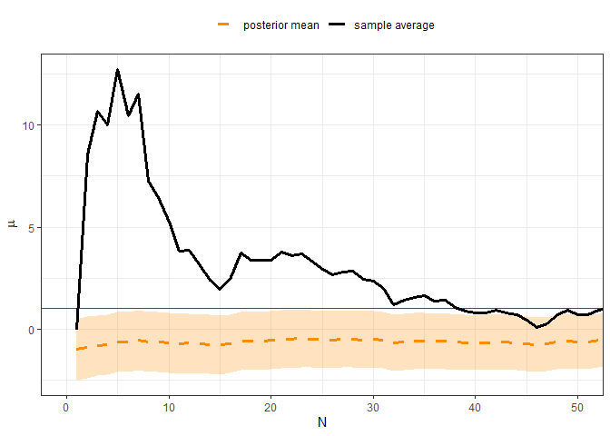<!-- -->

As we saw two figures previously, the sample average and the posterior
mean are converging as the sample size gets larger and larger. Let’s
make that clear by zooming in on the last 1000 samples.

``` r
post_summary_noisy %>% 
  ggplot(mapping = aes(x = N)) +
  geom_hline(yintercept = mu_true, color = "red") +
  geom_ribbon(mapping = aes(ymin = post_mu - 2*post_sd,
                            ymax = post_mu + 2*post_sd),
              fill = "darkorange", alpha = 0.25) +
  geom_line(mapping = aes(y = post_mu,
                          color = "posterior mean",
                          linetype = "posterior mean"),
            size = 1.2) +
  geom_line(mapping = aes(y = sample_avg,
                          color = "sample average",
                          linetype = "sample average"),
            size = 1.2) +
  coord_cartesian(xlim = c(4001, 5000), ylim = c(0, 2)) +
  scale_color_manual("",
                     values = c("posterior mean" = "darkorange",
                                "sample average" = "black")) +
  scale_linetype_manual("",
                     values = c("posterior mean" = "dashed",
                                "sample average" = "solid")) +
  labs(y = expression(mu)) +
  theme_bw() +
  theme(legend.position = "top")
```

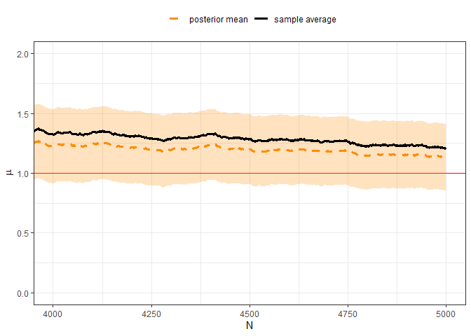<!-- -->

### Other priors?

Setting priors is not easy. With the noisy data, our informative prior
helps prevent scatter in the data from impacting our noise estimate at
low sample sizes. However, our results still do not seem “satisfactory”.
In some ways our informative prior appears a little too restrictive. We
could retry the analysis with a slightly less restrictive prior such as
with , or . **You could build off of the code in this markdown to
try out those priors on your own. If we repeated the analysis with a
very diffuse prior, such as  what would you expect to happen?**

The true answer for the “best” prior is that…it depends on the
situation. Ideally the prior should reflect your current best
understanding, your belief, about plausible parameter values. You can
take some comfort in the fact that as the sample size increases, if you
are “wrong”, your belief will be adjusted. But, I personally feel it’s
best to try out several priors to understand the sensitivity of the
posterior to our assumptions, rather than spending the time to find the
“absolute best possible prior”.
